<div align="center">

# 🐝 BeeSmart

### Carnetul digital inteligent pentru stupină

**Management apicol offline-first, analiză AI a ramelor și recomandări explicabile, într-o singură aplicație Android.**

[](BeeSmart/)
[](BeeSmart/app/src/main/java/com/example/beesmart/)
[](ApiaryServer/ApiaryServer/)
[](ApiaryServer/ApiaryServer/AIService/)
[](ApiaryServer/ApiaryServer/docker-compose.yml)

[Prezentare](#prezentare) · [Capturi](#aplicația-în-imagini) · [Arhitectură](#arhitectură) · [Pornire rapidă](#pornire-rapidă) · [Testare](#testare) · [Documentație](#documentația-proiectului)

<br>

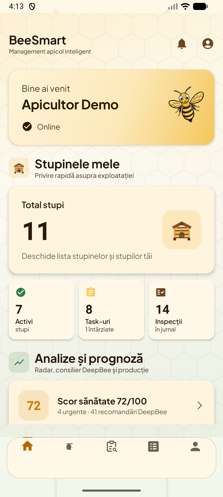
&nbsp;&nbsp;&nbsp;
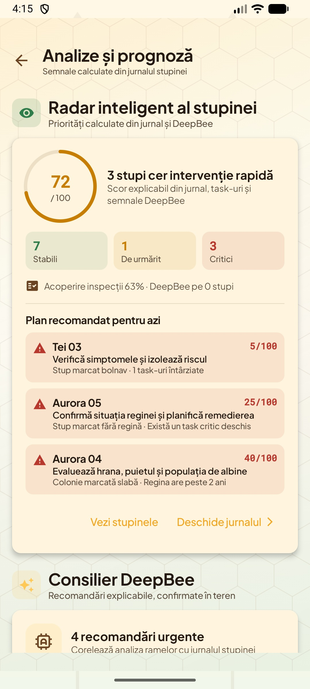

</div>

---

## Prezentare

BeeSmart este o platformă full-stack pentru managementul stupinelor, realizată ca proiect de licență. Aplicația transformă observațiile din teren într-un istoric coerent al fiecărui stup: inspecții, fotografii, tratamente, extracții, activități, condiții meteo și rezultate ale analizelor AI.

Proiectul este construit în jurul unei realități simple: în stupină, conexiunea la internet nu este garantată. Datele pot fi introduse offline, sunt păstrate local în Room și se sincronizează automat când conexiunea revine.

> **Principiul BeeSmart:** inteligența artificială oferă indicii și recomandări explicabile, dar nu înlocuiește verificarea fizică a stupului și nici diagnosticul medicului veterinar.

### Ce aduce aplicația

| Zonă | Capabilități |
| --- | --- |
| **Stupine și stupi** | Evidență completă, statusuri, istoric, locație, meteo și acces rapid prin cod QR |
| **Inspecții inteligente** | Formulare structurate, fotografii, voce, indicatori despre regină, puiet, rezerve, roire și igienă |
| **Analiză DeepBee** | Clasificarea celulelor din fagure, evaluarea calității fotografiei și metrici spațiale |
| **Suport decizional** | Index de sănătate, radar STABLE / WATCH / CRITICAL, recomandări prioritizate și calendar sezonier |
| **Lucrări apicole** | Task-uri, tratamente, extracții, remindere și istoric de notificări |
| **Lucru în teren** | Funcționare offline-first, sincronizare automată, comenzi vocale și scanare QR |

## Aplicația în imagini

Capturile de mai jos provin din aplicația Android reală și sunt aceleași imagini folosite în [lucrarea scrisă](Documentatie/template/TeX_files/chapter05.tex).

### Acasă și acces rapid

<table>
  <tr>
    <td align="center" width="50%">
      <br>
      <sub><b>Sumarul stupinei</b> — stare online, stupi, inspecții și scorul de sănătate</sub>
    </td>
    <td align="center" width="50%">
      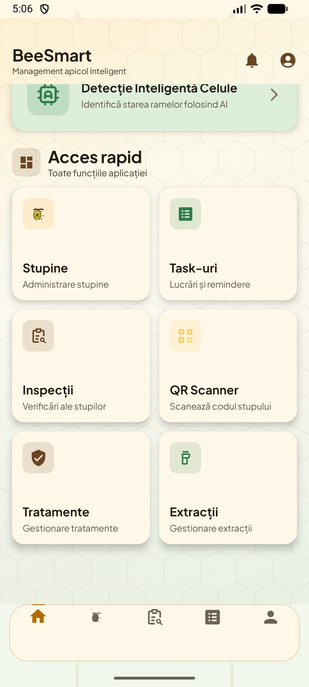<br>
      <sub><b>Acces rapid</b> — stupine, task-uri, inspecții, QR, tratamente și extracții</sub>
    </td>
  </tr>
</table>

### Stupine și stupi

<table>
  <tr>
    <td align="center" width="50%">
      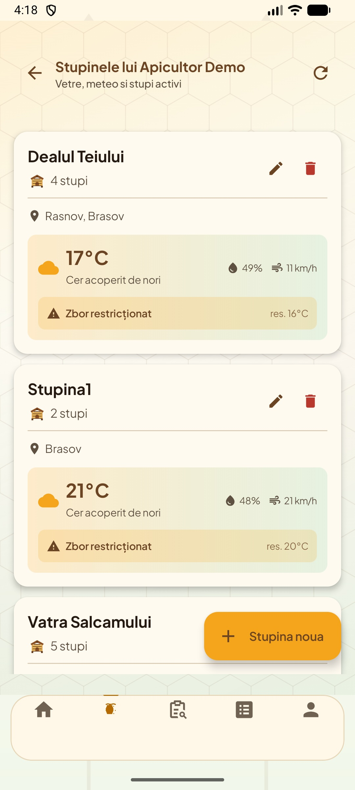<br>
      <sub><b>Stupine</b> — sumar, stare și date meteo contextuale</sub>
    </td>
    <td align="center" width="50%">
      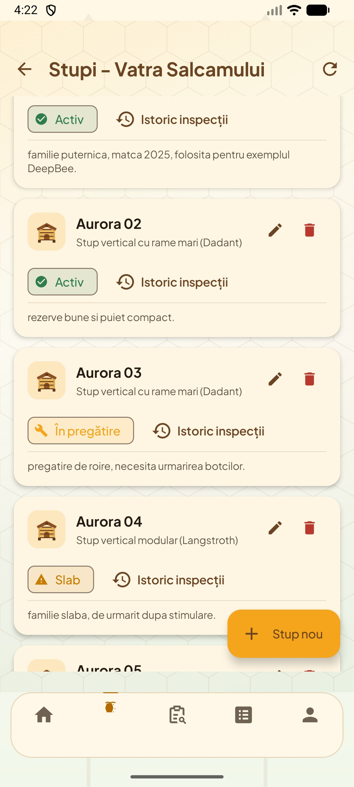<br>
      <sub><b>Stupi</b> — statusuri vizibile și prioritizarea familiilor care cer atenție</sub>
    </td>
  </tr>
</table>

### Inspecții și analiza ramei

<table>
  <tr>
    <td align="center" width="50%">
      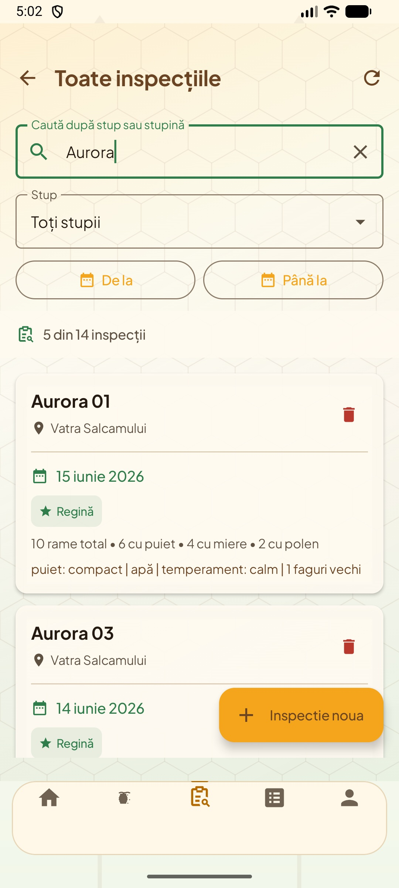<br>
      <sub><b>Jurnalul de inspecții</b> — căutare, filtre și indicatorii principali</sub>
    </td>
    <td align="center" width="50%">
      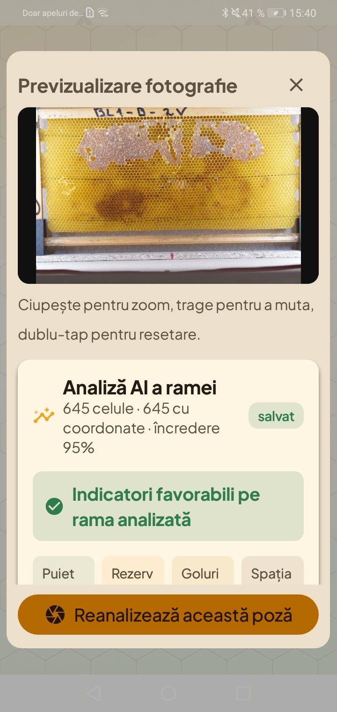<br>
      <sub><b>Analiză AI</b> — celule detectate, încredere și verdict orientativ</sub>
    </td>
  </tr>
</table>

### Evoluție și suport decizional

<table>
  <tr>
    <td align="center" width="50%">
      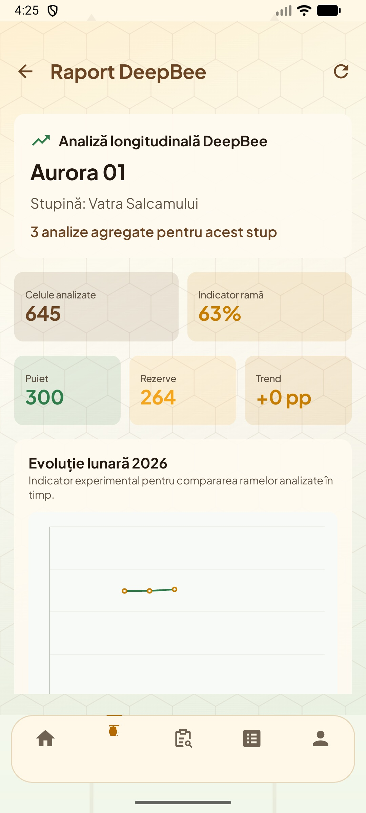<br>
      <sub><b>Raport longitudinal</b> — evoluția indicatorilor unui stup în timp</sub>
    </td>
    <td align="center" width="50%">
      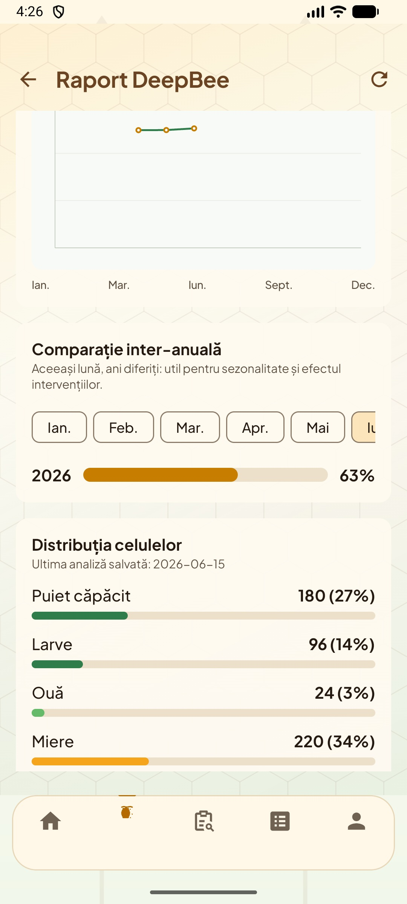<br>
      <sub><b>Distribuția celulelor</b> — puiet, rezerve și structura ultimei analize</sub>
    </td>
  </tr>
</table>

### Planificarea lucrărilor

<table>
  <tr>
    <td align="center" width="50%">
      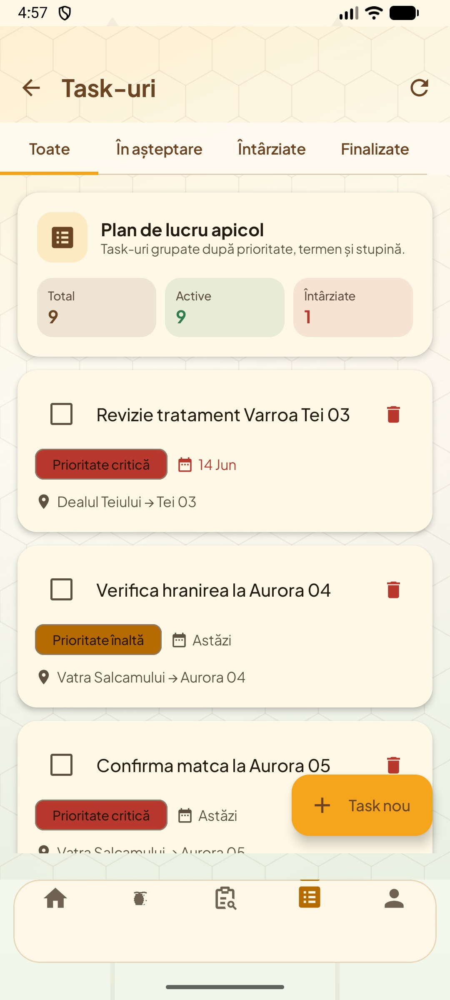<br>
      <sub><b>Task-uri</b> — lucrări grupate după status, termen și prioritate</sub>
    </td>
    <td align="center" width="50%">
      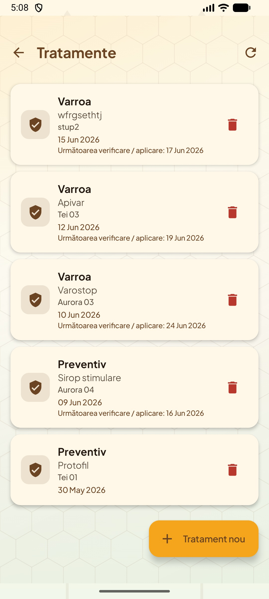<br>
      <sub><b>Tratamente</b> — produs, doză, dată și următoarea verificare</sub>
    </td>
  </tr>
</table>

## Funcționalități principale

- autentificare JWT, refresh token, confirmare email și resetare parolă prin deep link;
- creare și administrare de stupine și stupi, inclusiv offline;
- inspecție inteligentă cu date despre regină, puiet, rezerve, roire, igienă și comportament;
- fotografii din cameră sau galerie și analiză individuală ori în lot;
- clasificarea celulelor în `Capped`, `Eggs`, `Honey`, `Larves`, `Nectar`, `Other` și `Pollen`;
- raport DeepBee longitudinal și distribuția ultimei analize;
- radar inteligent la nivel de stupină și recomandări cu dovezi din jurnal;
- evidența tratamentelor, extracțiilor și task-urilor;
- notificări locale și reprogramarea lor după repornirea telefonului;
- vreme curentă, prognoză și calitatea aerului prin OpenWeatherMap;
- generare și scanare QR pentru deschiderea directă a fișei unui stup;
- completarea vocală a formularelor în limba română;
- sincronizare automată în fundal prin WorkManager.

## Arhitectură

BeeSmart este alcătuit din trei aplicații și două niveluri de persistență. Clientul Android comunică numai cu API-ul; accesul la serviciul AI este mediat de backend.

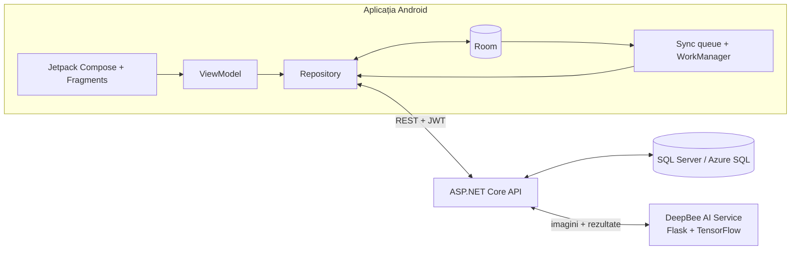

### Client Android

- **MVVM + Repository**, cu UI reactiv în Jetpack Compose;
- **Hilt** pentru injectarea dependențelor;
- **Retrofit, OkHttp și Moshi** pentru comunicarea cu API-urile;
- **Room** pentru date locale și coada de sincronizare;
- **WorkManager** pentru procesarea operațiilor amânate;
- **CameraX, ML Kit și ZXing** pentru fotografii și coduri QR.

### Backend

API-ul urmează o separare de tip Clean Architecture:

```text
Api → Application → Domain ← Infrastructure
```

- controllere REST și autentificare JWT;
- servicii de business și verificări de ownership;
- Entity Framework Core și SQL Server;
- Swagger/OpenAPI în mediul de dezvoltare;
- rate limiting și aplicarea automată a migrărilor la pornire;
- integrarea controlată cu serviciul AI.

### Serviciul AI

Microserviciul Python rulează modelele DeepBee pentru segmentare și clasificare. Fluxul principal este:

```text
fotografie → verificarea calității → segmentarea fagurelui
           → detectarea celulelor → clasificare → metrici și coordonate
```

Răspunsul diferențiază rezultatele valide de fotografiile slabe sau nepotrivite prin statusurile `success`, `low_quality`, `not_comb_image` și `uncertain_analysis`.

## Cum funcționează modul offline-first

Când nu există conexiune, modificările sunt salvate imediat în Room și adăugate în coada locală. La revenirea conexiunii, `SyncManager` procesează operațiile în ordinea dependențelor:

```text
APIARY → HIVE → TASK / TREATMENT / EXTRACTION / INSPECTION → INSPECTION_PHOTO
```

Entitățile copil așteaptă până când părintele primește un identificator de la server. În acest fel, utilizatorul poate crea în aceeași sesiune offline o stupină, stupii ei, inspecții și fotografii fără să piardă date sau relațiile dintre ele.

## Stack tehnologic

| Componentă | Tehnologii |
| --- | --- |
| **Android** | Kotlin, Jetpack Compose, Fragments, Navigation, Hilt, Room, WorkManager, Retrofit, OkHttp, Moshi |
| **Funcții mobile** | CameraX, ML Kit Barcode Scanning, ZXing, Android SpeechRecognizer, AlarmManager |
| **Backend** | C#, ASP.NET Core 8, Entity Framework Core, JWT Bearer, Swagger/OpenAPI |
| **Date** | Room, SQL Server 2022, Azure SQL Database |
| **AI** | Python, Flask, OpenCV, TensorFlow, Keras, modelele DeepBee |
| **Infrastructură** | Docker Compose, Azure Container Apps |
| **Testare** | JUnit, MockK, Robolectric, MockWebServer, xUnit |

## Structura proiectului

```text
BeeSmart-App/
├── BeeSmart/                       # Aplicația Android
│   ├── app/src/main/java/.../
│   │   ├── data/local/             # Room, DAO-uri și entități
│   │   ├── data/repository/        # Date, sincronizare și analytics
│   │   ├── network/                # Retrofit, interceptori și modele
│   │   ├── sync/                   # SyncManager, Worker și scheduler
│   │   ├── notifications/          # Task-uri și tratamente
│   │   └── ui/                     # Ecranele aplicației
│   └── app/src/test/               # Teste JVM și de integrare
│
├── ApiaryServer/
│   ├── ApiaryServer/               # API-ul ASP.NET Core
│   │   ├── Api/                    # Controllere HTTP
│   │   ├── Application/            # DTO-uri, interfețe și opțiuni
│   │   ├── Domain/                 # Entități de business
│   │   ├── Infrastructure/         # EF Core, repository-uri și servicii
│   │   ├── AIService/              # Microserviciul Python DeepBee
│   │   └── Migrations/             # Migrări EF Core
│   └── ApiaryServer.Tests/         # Teste xUnit
│
└── Documentatie/                   # Lucrarea scrisă și capturile aplicației
```

## Pornire rapidă

### Cerințe

- Android Studio, Android SDK 36 și JDK 17;
- .NET SDK 8;
- Docker Desktop cu Docker Compose, pentru rularea întregului backend;
- o cheie OpenWeatherMap, opțională pentru cardurile meteo.

### 1. Backend complet cu Docker

Creează fișierul `ApiaryServer/ApiaryServer/.env`:

```dotenv
DB_PASSWORD=Choose_A_Strong_SQL_Password_123!
Jwt__Issuer=ApiaryServer
Jwt__Audience=ApiaryClient
Jwt__Secret=replace_with_at_least_32_random_characters
```

Pornește SQL Server, serviciul AI și API-ul:

```powershell
cd ApiaryServer\ApiaryServer
docker compose up --build -d
```

| Serviciu | Adresă locală |
| --- | --- |
| API | `http://localhost:8080` |
| Swagger | `http://localhost:8080/swagger` |
| DeepBee AI | `http://localhost:5000` |
| SQL Server | `localhost:1433` |

Oprire:

```powershell
docker compose down
```

### 2. Aplicația Android

Adaugă cheia meteo în `BeeSmart/local.properties`, dacă dorești integrarea OpenWeatherMap:

```properties
openweather_api_key=your_key_here
```

Construiește aplicația și rulează testele:

```powershell
cd BeeSmart
.\gradlew.bat assembleDebug
.\gradlew.bat testDebugUnitTest
```

APK-ul debug este generat în `BeeSmart/app/build/outputs/apk/debug/`.

> În configurația curentă, aplicația folosește endpoint-ul Azure definit în [`NetworkConfig.kt`](BeeSmart/app/src/main/java/com/example/beesmart/utils/NetworkConfig.kt). Pentru un backend local, schimbă baza URL cu `http://10.0.2.2:8080/` pe emulator sau cu adresa IP din rețeaua locală pe un telefon fizic.

### 3. Backend fără Docker

Este necesar un SQL Server accesibil și un serviciu AI pornit separat.

```powershell
cd ApiaryServer\ApiaryServer
dotnet restore
dotnet run
```

Configurează conexiunea, JWT-ul, SMTP-ul și serviciul AI prin `appsettings.Development.json`, `.env` sau variabile de mediu. Nu salva secrete reale în Git.

## Configurare importantă

| Configurație | Locație |
| --- | --- |
| Cheie OpenWeatherMap | `BeeSmart/local.properties` → `openweather_api_key` |
| URL backend Android | `BeeSmart/app/src/main/java/.../utils/NetworkConfig.kt` |
| Deep links și QR | `BeeSmart/gradle.properties` |
| Conexiune SQL și JWT | variabile de mediu sau `appsettings.Development.json` |
| URL serviciu AI | `AiService__BaseUrl` |
| SMTP | secțiunea `Smtp` sau variabile de mediu echivalente |

Deep link-uri acceptate:

```text
https://app.beesmart.ro/hive/{hiveId}
beesmart://hive/{hiveId}
```

## API REST

Toate resursele operaționale sunt protejate prin JWT Bearer.

| Resursă | Prefix principal |
| --- | --- |
| Autentificare și profil | `/auth` |
| Stupine | `/api/apiaries` |
| Stupi | `/api/hives` |
| Inspecții, fotografii și analiză AI | `/inspections` |
| Tratamente | `/api/treatments` |
| Extracții | `/api/extractions` |
| Task-uri | `/api/tasks` |

Schema completă și testarea interactivă a endpoint-urilor sunt disponibile în Swagger când API-ul rulează în mediul `Development`.

## Testare

### Android

Testele rulează pe JVM prin Robolectric și folosesc MockWebServer pentru scenariile de rețea. Sunt acoperite repository-urile, ViewModel-urile, sincronizarea offline-online, retry-urile, calculele de analytics și interpretarea rezultatelor AI.

```powershell
cd BeeSmart
.\gradlew.bat testDebugUnitTest
```

Pentru testele instrumentate este necesar un emulator sau un dispozitiv Android:

```powershell
.\gradlew.bat connectedAndroidTest
```

### Backend

Suita xUnit verifică autentificarea, serviciile de business, ownership-ul resurselor, persistența și integrarea cu serviciul AI.

```powershell
cd ApiaryServer
dotnet test
```

## Securitate și limite asumate

- secretul JWT trebuie să aibă cel puțin 32 de caractere; serverul refuză valorile placeholder;
- backend-ul validează ownership-ul resurselor și aplică rate limiting;
- detectările AI sunt validate înainte de persistare;
- AI-ul nu stabilește diagnostice și nu prescrie tratamente;
- rezultatul analizei depinde de claritatea, lumina și poziționarea fotografiei;
- fotografiile sunt transmise ca Data URI/Base64, o soluție potrivită prototipului, dar nu stocării la scară mare;
- rezolvarea conflictelor între mai multe dispozitive poate fi extinsă;
- clienții HTTP Android folosesc momentan o configurație TLS permisivă pentru dezvoltare; aceasta trebuie înlocuită cu validarea standard a certificatelor înaintea unei lansări de producție.

## Documentația proiectului

Lucrarea de licență este păstrată în format LaTeX în directorul [`Documentatie/template`](Documentatie/template/). Puncte utile de intrare:

- [capitolul despre tehnologii](Documentatie/template/TeX_files/chapter02.tex);
- [proiectarea și implementarea sistemului](Documentatie/template/TeX_files/chapter04.tex);
- [descrierea funcțională și capturile aplicației](Documentatie/template/TeX_files/chapter05.tex);
- [concluzii și direcții viitoare](Documentatie/template/TeX_files/chapter06.tex);
- [auditul funcționalităților apicole](Documentatie/AUDIT_FUNCTIONALITATI_APICULTURA.md).

## Autor și atribuiri

Proiect realizat de **Lixandru Valentina-Mariana**, în cadrul lucrării de licență „BeeSmart: aplicație mobilă dedicată apiculturii de precizie pentru digitalizarea și optimizarea managementului stupinelor”, Universitatea Transilvania din Brașov, 2026.

Modelele de analiză a celulelor au la bază proiectul **DeepBee**. Atribuirile bibliotecilor și componentelor terțe sunt disponibile în [`THIRD_PARTY_NOTICES.md`](ApiaryServer/ApiaryServer/AIService/THIRD_PARTY_NOTICES.md).

Proiectul nu include în prezent o licență open-source declarată.

---

<div align="center">
  <sub>BeeSmart — tehnologie care completează experiența apicultorului, nu o înlocuiește.</sub>
</div>
